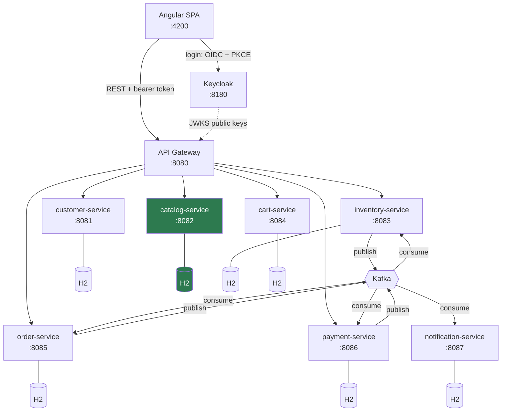
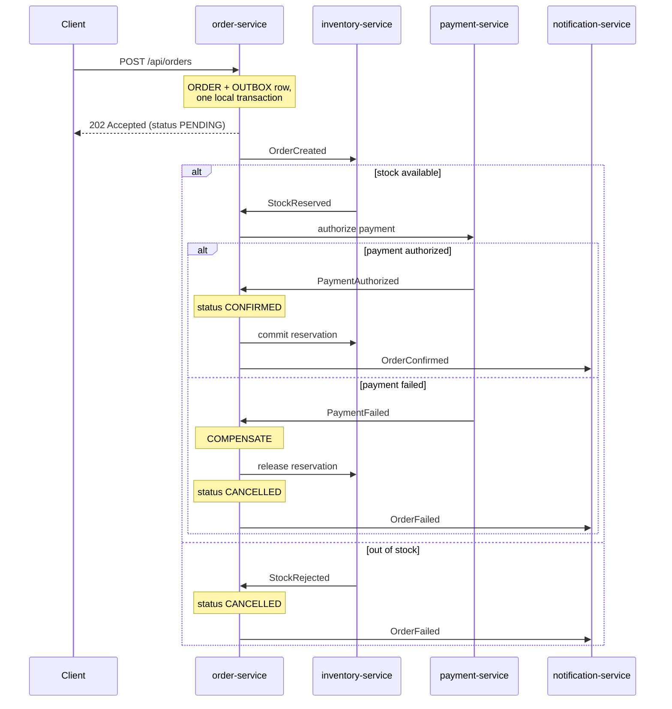

# Architecture

System-level reference. For the reasoning behind these choices and the delivery
roadmap, see [PLAN.md](../PLAN.md).

## System overview



Green indicates what is implemented today. Everything else is designed but not built.

Keycloak sits outside the request path deliberately: services validate JWTs offline
against cached public keys, so Keycloak being down blocks new logins but not
authenticated API calls.

## The two rules

Everything else follows from these.

### 1. A service touches only its own database

No shared tables, no cross-service joins, no reaching into another service's data.
With embedded H2 this is enforced by physics — each service's data lives inside its
own JVM process and is unreachable from any other. If a service needs data it does
not own, it calls an API or consumes an event.

The corollary: **some duplication is correct**. `order-service` copies the shipping
address into the order rather than referencing `customer-service`, because an order
records what was agreed at a point in time. Editing your address next month must not
rewrite last month's orders.

### 2. Synchronous for reads, asynchronous for writes with side effects

| Interaction | Style | Why |
|---|---|---|
| Browse products | REST | The caller needs the answer now, and a failure means an empty list |
| Fetch order history | REST | Same |
| Place an order | Events | Spans four services; partial failure must be recoverable, not lost |
| Send a confirmation email | Events | The order must not fail because an SMTP server is slow |

This is the most consequential decision in the project. Phase 2 deliberately builds
order placement synchronously so the fragility is felt first; Phase 3 converts it.

## URL conventions

**Paths name resources, never services.** `/api/products`, not `/api/catalog/products`.

This is worth stating explicitly because it looks inconsistent at first glance:
`catalog-service` serves `/api/products` and `/api/categories`, while most services
appear to "own" a path matching their name. They don't. `/api/orders` is the orders
collection, which simply happens to be the only resource `order-service` owns.
`catalog-service` owns two resources, so neither can coincide with its name.

| Resource | Owned by |
|---|---|
| `/api/products`, `/api/categories` | catalog-service |
| `/api/customers` | customer-service |
| `/api/cart` | cart-service |
| `/api/stock`, `/api/reservations` | inventory-service |
| `/api/orders` | order-service |
| `/api/payments` | payment-service |
| `/api/notifications` | notification-service |

### Why not service-based paths

**The URL is a public contract; which service answers it is an implementation
detail.** PLAN.md §10 already contemplates folding `inventory-service` into
`order-service` if time runs short, and splitting search out of `catalog-service`
later if SQL search proves insufficient. Under this convention both are gateway
routing changes that no client notices. Under `/api/inventory/...` they would be
breaking API changes.

The cost is that the gateway needs a route per resource rather than per service, and
that ownership is not visible from the URL. That's what the table above is for.

### Rules

- **One controller per resource**, mapped to the full resource path
  (`@RequestMapping("/api/products")`). A controller mapped at `/api` that serves
  several resources becomes a catch-all.
- **Collections are plural** (`/api/products`), except genuine singletons —
  `/api/cart` is one cart per caller, not a collection.
- **Sub-resources nest** (`/api/customers/me/addresses`); unrelated resources do not
  (`/api/reservations`, not `/api/stock/reservations`).
- **Filters are query parameters, not paths.** `/api/stock?belowReorderLevel=true`,
  not `/api/stock/low-stock` — "low stock" is a query over stock, not a resource.
- **Identifiers in paths are always public UUIDs or natural keys** (a SKU, a category
  slug), never internal database ids.

## Communication patterns

### Synchronous (REST)

- Client → gateway → service. The SPA knows exactly one base URL.
- Every outbound call carries a timeout, a circuit breaker and a retry policy
  (Resilience4j). No exceptions — an untimed call is how one slow service takes down
  the rest.
- `X-Correlation-Id` propagates across every hop. Generated at the edge if absent.

### Asynchronous (Kafka)

Three mandatory patterns, detailed in [PLAN.md §3](../PLAN.md):

1. **Transactional outbox** — a service writes its business change and an `OUTBOX`
   row in one local transaction; a poller publishes them afterwards. Never write to
   the database and publish to Kafka as two independent steps hoping both succeed.
2. **Idempotent consumers** — Kafka guarantees at-least-once delivery. Every handler
   records processed `eventId`s in a `PROCESSED_EVENTS` table with a unique
   constraint and ignores repeats.
3. **Saga timeouts** — a scheduled job cancels anything stuck in a non-terminal state.
   Without it, one dropped message leaves an order hung forever.

All events implement
[`DomainEvent`](../common/common-events/src/main/java/com/ecommerce/common/events/DomainEvent.java):
`eventId` (the idempotency key), `occurredAt` (when the fact happened, not when it
was published) and `eventType`.

## Order placement saga

The centrepiece of the project. `order-service` orchestrates — one visible,
debuggable state machine rather than diffuse choreography.



Order states: `PENDING → STOCK_RESERVED → PAID → CONFIRMED → SHIPPED → DELIVERED`,
plus terminal `CANCELLED` and `FAILED`. Transitions are validated in code and every
one is appended to `ORDER_EVENTS` — that table is both the audit trail and the first
place to look when something is stuck.

## Data ownership

Each row belongs to exactly one service. Nothing else may read it directly.

| Data | Owner | Notes |
|---|---|---|
| Credentials, roles, tokens, sessions | **Keycloak** | No service stores a password hash |
| Customer profile, addresses | customer-service | Keyed on Keycloak's `sub` claim |
| Products, categories | catalog-service | Public reads, `ADMIN` writes |
| Stock levels, reservations | inventory-service | Optimistic locking on decrements |
| Active carts | cart-service | Expiry sweep |
| Orders, order lines, order state | order-service | Address and prices copied at checkout |
| Payments, refunds | payment-service | Simulated gateway; no real card data |
| Notification log | notification-service | Event-driven only |

## Cross-cutting concerns

| Concern | Choice | Status |
|---|---|---|
| Authentication | Keycloak, OIDC + PKCE; services are resource servers validating JWTs offline | Phase 1 |
| Authorization | Keycloak realm roles (`CUSTOMER`, `ADMIN`) → `ROLE_`-prefixed authorities, enforced at gateway *and* service | Phase 1 |
| Service discovery | Container DNS (Compose, then Kubernetes). No Eureka | Phase 2 |
| Configuration | Per-service `application.yml` + profiles + env vars | ✅ |
| Error contract | Shared `ApiError` from `common-web`, identical across all services | ✅ |
| Correlation IDs | `common-web` filter; `X-Correlation-Id` in, SLF4J MDC, echoed out | ✅ |
| Resilience | Resilience4j on every outbound call | Phase 3 |
| Messaging | Kafka, with transactional outbox | Phase 3 |
| Tracing | OpenTelemetry → Jaeger | Phase 3 |
| Metrics | Actuator + Micrometer → Prometheus → Grafana | Phase 3 |
| API docs | springdoc-openapi per service | ✅ |

### Shared code

Only two modules, kept deliberately thin — shared libraries are how microservices
quietly re-couple.

- **`common-web`** — `ApiError`, `GlobalExceptionHandler`, `ResourceNotFoundException`,
  `CorrelationIdFilter`. Registered through Spring **auto-configuration**
  (`META-INF/spring/org.springframework.boot.autoconfigure.AutoConfiguration.imports`),
  so a service gets all of it by declaring the dependency. No `scanBasePackages`
  widening, which would scan anything that ever lands on the classpath.
- **`common-events`** — event contracts only. Jackson annotations, nothing else.

Business logic never belongs in either.

## Persistence

**H2, embedded, one database per service.** A deliberate step back from Oracle: the
goal is learning distributed-system patterns, not database administration. See
[PLAN.md §4](../PLAN.md) for the full reasoning and the conventions that keep a later
swap cheap.

| Profile | URL | Purpose |
|---|---|---|
| `dev` | `jdbc:h2:file:./data/<service>;AUTO_SERVER=TRUE` | Survives restarts; attachable by a SQL client |
| `test` | `jdbc:h2:mem:<service>-test` | Fresh per run; milliseconds to start |

Rules that apply to every service:

- **Flyway owns the schema.** `ddl-auto: validate` — entity/schema drift fails
  startup instead of silently reshaping tables.
- **Vendor-neutral SQL** in migrations. Plain `VARCHAR`, `NUMERIC`, `TIMESTAMP`,
  standard `GENERATED BY DEFAULT AS IDENTITY`.
- **`BIGINT IDENTITY` internal PK plus a `public_id VARCHAR(36)` UUID.** Internal ids
  never appear in a URL or cross a service boundary. `VARCHAR(36)` rather than a
  native UUID type because Oracle has none.
- **Money is `NUMERIC(19,4)` → `BigDecimal`.** Never a floating-point type.
- **Time is UTC**, `TIMESTAMP` → `Instant`/`OffsetDateTime`.
- **Optimistic locking** via a `version` column, not `SELECT … FOR UPDATE` — JPA-level
  and consistent across every database.
- **Seed data lives in `db/seed`**, loaded only in `dev`, so no test can pass on demo
  rows.

Known limitation: embedded H2 cannot support multiple replicas of a service, since
each pod would hold its own private data. That is the point at which a real database
becomes necessary (PLAN.md Phase 8).

## Containerisation

`infra/docker-compose.yml` runs the whole stack: Keycloak, both services and the SPA.

| Service | Image | Build context | Notes |
|---|---|---|---|
| keycloak | `quay.io/keycloak/keycloak` | — | Realm imported from committed JSON |
| catalog-service | multi-stage Maven → JRE | **repo root** | Reactor module needs the parent POM |
| customer-service | multi-stage Maven → JRE | **repo root** | Same |
| frontend | Node build → nginx | `frontend/` | No Maven dependency |

Points worth understanding:

- **Service build contexts are the repo root**, not the service directory. A Maven
  reactor module cannot compile without its parent POM and the `common/` modules it
  depends on. `.dockerignore` keeps `target/`, `node_modules/` and H2 files out.
- **Multi-stage everywhere.** The Maven and Node builders never ship; only a JRE with
  a jar, and nginx with a bundle. The frontend image is under 100MB as a result.
- **Each service has a named volume** at `/app/data` for its H2 file. Without it the
  catalog would reseed and customer data vanish whenever a container is replaced.
- **`depends_on: condition: service_healthy`** makes customer-service wait for
  Keycloak's realm import to finish, not merely for its container to exist.
- **The issuer/JWKS split** described below is the one genuinely non-obvious part.
- **Services run as a non-root user**, and the frontend is published on host port 4200
  (nginx listens on 80) because the `ecom-web` client's redirect URIs are registered
  for `localhost:4200`.

### Issuer vs. JWKS inside Docker

A browser obtains tokens from `http://localhost:8180`, so `iss` is always
`localhost:8180` — `KC_HOSTNAME` guarantees it regardless of caller. But inside a
container `localhost` is that container, so keys must be fetched over the compose
network instead:

```yaml
KEYCLOAK_ISSUER_URI:  http://localhost:8180/realms/ecommerce
KEYCLOAK_JWK_SET_URI: http://keycloak:8080/realms/ecommerce/protocol/openid-connect/certs
```

Spring uses `jwk-set-uri` to build the decoder and `issuer-uri` for the validator, so
setting both gives exactly the required behaviour. Setting only `issuer-uri` makes
Spring derive the JWKS URL from it and fail in Docker; setting only `jwk-set-uri`
skips issuer validation altogether.

## Port map

| Port | Process |
|---|---|
| 4200 | Angular dev server (proxies `/api` → 8082) |
| 8080 | api-gateway |
| 8081 | customer-service |
| 8082 | **catalog-service** (running today) |
| 8083 | inventory-service |
| 8084 | cart-service |
| 8085 | order-service |
| 8086 | payment-service |
| 8087 | notification-service |
| 8180 | Keycloak |

Keycloak is on 8180 to stay clear of the gateway.

## Frontend

Angular 21, standalone components, **zoneless** (no `zone.js`) — which is why all
component state is signals: mutating a plain field would not schedule a render.

```
frontend/src/app/
  core/            API base token, typed contract mirrors, HTTP error interceptor
  features/
    catalog/       product list (implemented)
    ...            cart, checkout, orders, account, admin (planned)
```

The SPA talks to one origin. In development the dev server proxies `/api` to
`catalog-service` (`frontend/proxy.conf.json`), so CORS never arises; from Phase 2
the same relative path resolves to the gateway with no frontend change.

The HTTP interceptor understands the shared `ApiError` shape, so no component parses
an error body. It also distinguishes "the service returned an error" from "nothing
answered at all" — a 5xx with no `ApiError` body means the response came from
infrastructure rather than application code.

## Technology summary

| Layer | Choice | Version |
|---|---|---|
| Language | Java | 21 (`release=21`) |
| Framework | Spring Boot | 3.5.0 |
| Build | Maven, multi-module, committed wrapper | 3.9.12 |
| Database | H2, embedded | Boot-managed |
| Migrations | Flyway | Boot-managed |
| API docs | springdoc-openapi | 2.8.6 |
| Frontend | Angular | 21.2 |
| Messaging | Kafka | Phase 3 |
| Identity | Keycloak | Phase 1 |

Version rationale and upgrade paths: [PLAN.md §9](../PLAN.md).
