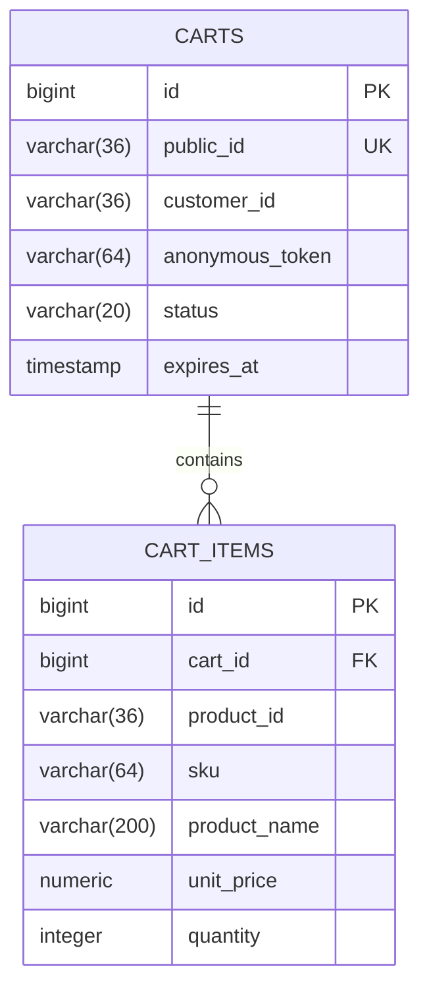

# cart-service

> ✅ **Implemented.** This document describes running code. Schema comes from
> `V1__create_cart_tables.sql`, endpoints from `CartController`.

Active shopping carts. Short-lived, mutable, and the one place where "eventually
correct" is genuinely fine.

| | |
|---|---|
| **Port** | 8084 |
| **Base path** | `/api/cart` |
| **Database** | `jdbc:h2:file:./data/cart` |
| **Module** | `services/cart-service` |
| **Package** | `com.ecommerce.cart` |
| **Auth** | **Anonymous-friendly.** A bearer token's `sub`, or the `X-Cart-Token` header |

## Responsibilities

**Owns:** cart contents, quantities, and the cart's lifetime.

**Does not own:** product names and prices (catalog-service), stock (inventory-service),
anything after checkout (order-service). A cart is a scratchpad, not a record.

**Redis was dropped.** The plan originally put carts in Redis for TTL semantics; this
project uses H2 tables plus a scheduled expiry sweep instead, to keep the
infrastructure count low. Reintroducing Redis is a clean, isolated upgrade in Phase 3
if cache/TTL semantics become something worth learning.

## Pricing: the important decision

**The cart stores a price snapshot per line, and re-validates against catalog-service
at checkout.**

- Storing no price means every cart render needs a catalog call per line.
- Storing a price and trusting it lets a customer hold a stale price indefinitely.

So: snapshot for display, re-check at checkout, and tell the customer if it moved.
`order-service` then copies the final agreed price into the order, because an order
must record what was actually agreed.

## Database schema

### `carts`

| Column | Type | Constraints |
|---|---|---|
| `id` | `BIGINT` | PK, identity |
| `public_id` | `VARCHAR(36)` | `NOT NULL`, unique |
| `customer_id` | `VARCHAR(36)` | nullable — Keycloak `sub`; null for anonymous |
| `anonymous_token` | `VARCHAR(64)` | nullable — set when `customer_id` is null |
| `status` | `VARCHAR(20)` | `NOT NULL` — `ACTIVE`, `CHECKED_OUT`, `ABANDONED`, `EXPIRED` |
| `currency` | `VARCHAR(3)` | `NOT NULL`, default `'USD'` |
| `created_at` | `TIMESTAMP` | `NOT NULL` |
| `updated_at` | `TIMESTAMP` | `NOT NULL` |
| `expires_at` | `TIMESTAMP` | `NOT NULL` |
| `version` | `INTEGER` | `NOT NULL`, default `0` |

**Constraint:** `ck_carts_one_owner` — a `CHECK` enforcing that exactly one of
`customer_id` / `anonymous_token` is non-null. Expressing it in the schema means no
application bug can create a cart with two owners or none.

**Indexes:** `ix_carts_customer (customer_id, status)`,
`ix_carts_anonymous (anonymous_token, status)`, `ix_carts_expiry (status, expires_at)`.

A partial unique index on "one active cart per customer" was considered and dropped —
H2 and Oracle express partial indexes differently, so it would break the
vendor-neutral SQL rule from PLAN.md §4. The service enforces it instead by always
looking up `(customer_id, ACTIVE)` before creating.

### `cart_items`

| Column | Type | Constraints |
|---|---|---|
| `id` | `BIGINT` | PK, identity |
| `cart_id` | `BIGINT` | `NOT NULL`, FK → `carts(id)` `ON DELETE CASCADE` |
| `product_id` | `VARCHAR(36)` | `NOT NULL` — product's public id |
| `sku` | `VARCHAR(64)` | `NOT NULL` |
| `product_name` | `VARCHAR(200)` | `NOT NULL` — snapshot for display |
| `unit_price` | `NUMERIC(19,4)` | `NOT NULL` — snapshot, re-validated at checkout |
| `quantity` | `INTEGER` | `NOT NULL`, `CHECK > 0` |
| `image_url` | `VARCHAR(500)` | nullable — snapshot |
| `added_at` | `TIMESTAMP` | `NOT NULL` |

**Constraint:** unique `(cart_id, product_id)` — adding an existing product increments
quantity rather than creating a second line.



### Expiry

`CartExpirySweeper` runs hourly, marking carts past `expires_at` as **`ABANDONED`** if
they held items or **`EXPIRED`** if empty. That distinction is what gives a Phase 3
abandoned-cart email something worth targeting — there is no point chasing an empty
basket.

It sweeps in batches of 200 rather than loading everything expired: a sweep that
fetches every stale cart at once is one that eventually runs out of memory instead of
doing its job. Whatever it misses, the next run picks up.

This is what Redis TTL would have done for free. Dropping Redis traded a container for
this class — a reasonable swap, but the cost is real: expiry is now approximate,
bounded by the sweep interval, rather than exact.

Lifetimes are configurable (`cart.ttl-signed-in`, `cart.ttl-anonymous`), defaulting to
30 days and 2 days. Anonymous carts get less because they belong to a browser rather
than a person.

## API endpoints

The cart is always derived from the caller's identity, never from a cart id in the
path. A `GET /api/cart/{id}` that trusted its parameter would let anyone read anyone's
cart, so no such endpoint exists.

**Ownership is resolved per request:** a bearer token means the cart belongs to that
`sub`; without one, it belongs to the `X-Cart-Token` header the SPA supplies. A token
wins over the header, so a stale `X-Cart-Token` left behind after login cannot
redirect a signed-in shopper's writes into an anonymous basket. A request with
*neither* is a `400` — the service refuses to guess rather than handing out a shared
default cart.

The security consequence is worth stating plainly: **an anonymous cart is only as
private as its token.** Acceptable because a cart holds no personal data, only product
ids — and it is why `/api/cart/merge` is the one endpoint requiring authentication.

| Method | Path | Purpose |
|---|---|---|
| `GET` | `/api/cart` | Current cart with computed totals. Creates an empty one if none |
| `POST` | `/api/cart/items` | Add a product. Increments if already present |
| `PATCH` | `/api/cart/items/{productId}` | Set quantity. `0` removes the line |
| `DELETE` | `/api/cart/items/{productId}` | Remove a line |
| `DELETE` | `/api/cart` | Empty the cart |
| `POST` | `/api/cart/merge` | Adopt an anonymous cart after signing in. **Requires a token** |
| `POST` | `/api/cart/validate` | Re-check prices and availability before checkout |

`DELETE /api/cart` returns `200` with the emptied cart rather than `204`, because the
client needs the updated totals to re-render and a second `GET` would be wasteful.

`GET /api/cart` response:

```json
{
  "id": "…",
  "currency": "USD",
  "items": [
    {
      "productId": "…",
      "sku": "KBD-0001",
      "productName": "Tactile 87 Mechanical Keyboard",
      "unitPrice": 179.0,
      "quantity": 2,
      "lineTotal": 358.0,
      "imageUrl": "…"
    }
  ],
  "itemCount": 2,
  "subtotal": 358.0,
  "expiresAt": "2026-09-26T12:00:00Z"
}
```

Totals are computed on read, never stored — a stored subtotal is one more thing that
can disagree with its own line items.

`POST /api/cart/validate` returns per-line changes so the UI can say "the price of X
changed from $179 to $189" rather than silently charging more:

```json
{
  "valid": false,
  "issues": [
    {
      "productId": "…",
      "productName": "Meridian 14 Ultrabook",
      "type": "PRICE_CHANGED",
      "oldPrice": 1499.0,
      "newPrice": 1599.0
    }
  ],
  "cart": { "…": "the cart, with snapshots refreshed to current values" }
}
```

Two details that matter:

- **Snapshots are refreshed as a side effect**, so the cart a shopper confirms is the
  cart they are charged for.
- Prices are compared with `BigDecimal.compareTo`, not `equals`. `equals` is
  scale-sensitive, so `179.00` and `179.0000` would compare unequal and report a
  phantom price change on every validate.

`INSUFFICIENT_STOCK` is **not** implemented — it needs inventory-service. The `Issue.Type`
enum currently has `PRICE_CHANGED` and `UNAVAILABLE` only.

### Anonymous cart merge

Anonymous browsing needs a cart, and logging in must not discard it — that is the
single most annoying bug an e-commerce site can have. On login the SPA calls
`POST /api/cart/merge` with the anonymous token.

Three cases, and the middle one is the optimisation worth noticing:

1. **No anonymous cart** — nothing to do; return the customer's cart.
2. **Customer has no cart yet** — `claimFor()` hands the anonymous cart over outright,
   clearing its token. No copying, no second row.
3. **Both exist** — quantities are summed per product, then the anonymous cart is
   emptied.

## Error responses

| Status | Cause |
|---|---|
| `400` | Quantity outside 0–99, or neither a token nor an `X-Cart-Token` supplied |
| `401` | `/api/cart/merge` without a token |
| `404` | Product unknown to catalog-service, or no such line in the cart |
| `409` | Cart already `CHECKED_OUT`; or a concurrent modification lost the `@Version` lock |
| `500` | **catalog-service unreachable** — see below |

**A catalog outage is not a missing product.** `CatalogClient` throws
`CatalogUnavailableException` on a timeout or connection failure, distinct from the
empty `Optional` that means "no such product". Reporting the two identically would
make both undiagnosable, so one is a `500` and the other a `404`. There is a test
pinning it.

Every call to catalog-service carries a timeout (`cart.catalog-timeout`, default 2s).
An untimed call is how one slow service exhausts another's threads. A circuit breaker
belongs here too and arrives with Resilience4j in Phase 3.

## Tests

31 tests, about 4 seconds.

| Class | Covers |
|---|---|
| `CartServiceApplicationTests` (1) | Context loads; migration runs; mappings validate |
| `CartTest` (10) | Aggregate rules with no Spring — line merging, snapshot precedence, totals, merge semantics, abandoned vs. expired |
| `CartControllerTest` (20) | Anonymous access, cart isolation by token and by `sub`, token beating a stale header, price coming from the catalog rather than the request, merge in all three cases, validate reporting changes, and a catalog outage not masquerading as a 404 |

`CatalogClient` is a `@MockitoBean` in the controller tests: the interesting behaviour
is cart-side, and whether the catalog answers correctly is its own suite's job. The
Phase 5 contract tests are what will pin that boundary.

## Events

**Not implemented.** Nothing is published or consumed today — Kafka arrives in Phase 3.

Planned:

| Event | When | Consumers |
|---|---|---|
| `CartCheckedOut` | Checkout starts | order-service |
| `CartAbandoned` | Expiry sweep finds an aged cart with items | notification-service |

**Consumes:**

| Event | Action |
|---|---|
| `OrderConfirmed` | Mark the cart `CHECKED_OUT` and clear it |

## Decisions deferred

- **Cart TTL** — days for logged-in customers, hours for anonymous? Needs numbers.
- **Whether anonymous carts are worth the complexity**, or checkout should require login.
- **Whether `cart-service` calls catalog-service synchronously** on add (simple, but
  couples availability) or consumes catalog events into a local read model (decoupled,
  more machinery).
- **Whether `CartAbandoned` emails are in scope** at all.
- **Redis reintroduction**, and whether the TTL learning justifies the container.
