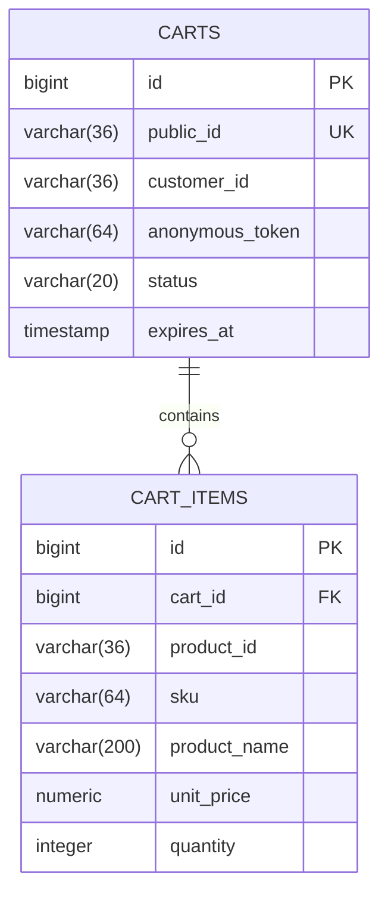

# cart-service

> 🔵 **Planned — Phase 2. Not implemented.** This is a design specification. Nothing
> described here exists yet, and details will change on contact with real code.

Active shopping carts. Short-lived, mutable, and the one place where "eventually
correct" is genuinely fine.

| | |
|---|---|
| **Port** | 8084 |
| **Base path** | `/api/cart` |
| **Database** | `jdbc:h2:file:./data/cart` |
| **Module** | `services/cart-service` (planned) |
| **Auth** | `CUSTOMER`; anonymous carts keyed by an opaque token |

## Responsibilities

**Owns:** cart contents, quantities, and the cart's lifetime.

**Does not own:** product names and prices (catalog-service), stock (inventory-service),
anything after checkout (order-service). A cart is a scratchpad, not a record.

**Redis was dropped.** The plan originally put carts in Redis for TTL semantics; this
project uses H2 tables plus a scheduled expiry sweep instead, to keep the
infrastructure count low. Reintroducing Redis is a clean, isolated upgrade in Phase 3
if cache/TTL semantics become something worth learning.

## Pricing: the important decision

**The cart stores a price snapshot per line, and re-validates against catalog-service
at checkout.**

- Storing no price means every cart render needs a catalog call per line.
- Storing a price and trusting it lets a customer hold a stale price indefinitely.

So: snapshot for display, re-check at checkout, and tell the customer if it moved.
`order-service` then copies the final agreed price into the order, because an order
must record what was actually agreed.

## Database schema

### `carts`

| Column | Type | Constraints |
|---|---|---|
| `id` | `BIGINT` | PK, identity |
| `public_id` | `VARCHAR(36)` | `NOT NULL`, unique |
| `customer_id` | `VARCHAR(36)` | nullable — Keycloak `sub`; null for anonymous |
| `anonymous_token` | `VARCHAR(64)` | nullable — set when `customer_id` is null |
| `status` | `VARCHAR(20)` | `NOT NULL` — `ACTIVE`, `CHECKED_OUT`, `ABANDONED`, `EXPIRED` |
| `currency` | `CHAR(3)` | `NOT NULL`, default `'USD'` |
| `created_at` | `TIMESTAMP` | `NOT NULL` |
| `updated_at` | `TIMESTAMP` | `NOT NULL` |
| `expires_at` | `TIMESTAMP` | `NOT NULL` |
| `version` | `INTEGER` | `NOT NULL`, default `0` |

**Constraint:** exactly one of `customer_id` / `anonymous_token` must be non-null.
**Indexes:** unique partial on `customer_id` where `status = 'ACTIVE'` (one active
cart per customer), `ix_carts_expiry (status, expires_at)`.

### `cart_items`

| Column | Type | Constraints |
|---|---|---|
| `id` | `BIGINT` | PK, identity |
| `cart_id` | `BIGINT` | `NOT NULL`, FK → `carts(id)` `ON DELETE CASCADE` |
| `product_id` | `VARCHAR(36)` | `NOT NULL` — product's public id |
| `sku` | `VARCHAR(64)` | `NOT NULL` |
| `product_name` | `VARCHAR(200)` | `NOT NULL` — snapshot for display |
| `unit_price` | `NUMERIC(19,4)` | `NOT NULL` — snapshot, re-validated at checkout |
| `quantity` | `INTEGER` | `NOT NULL`, `CHECK > 0` |
| `image_url` | `VARCHAR(500)` | nullable — snapshot |
| `added_at` | `TIMESTAMP` | `NOT NULL` |

**Constraint:** unique `(cart_id, product_id)` — adding an existing product increments
quantity rather than creating a second line.



### Expiry

A scheduled job marks carts past `expires_at` as `EXPIRED` and deletes rows older
than a retention window. `ON DELETE CASCADE` handles the items. This replaces what
Redis TTL would have done for free — the trade-off accepted above.

## API endpoints

The cart is always derived from the caller's identity, never from a cart id in the
path. A `GET /api/cart/{id}` that trusted its parameter would let anyone read anyone's
cart.

| Method | Path | Purpose |
|---|---|---|
| `GET` | `/api/cart` | Current cart with computed totals. Creates an empty one if none |
| `POST` | `/api/cart/items` | Add a product. Increments if already present |
| `PATCH` | `/api/cart/items/{productId}` | Set quantity. `0` removes the line |
| `DELETE` | `/api/cart/items/{productId}` | Remove a line |
| `DELETE` | `/api/cart` | Empty the cart |
| `POST` | `/api/cart/merge` | Merge an anonymous cart into the customer's on login |
| `POST` | `/api/cart/validate` | Re-check prices and availability before checkout |

`GET /api/cart` response:

```json
{
  "id": "…",
  "currency": "USD",
  "items": [
    {
      "productId": "…",
      "sku": "KBD-0001",
      "productName": "Tactile 87 Mechanical Keyboard",
      "unitPrice": 179.0,
      "quantity": 2,
      "lineTotal": 358.0,
      "imageUrl": "…"
    }
  ],
  "itemCount": 2,
  "subtotal": 358.0,
  "expiresAt": "2026-09-26T12:00:00Z"
}
```

Totals are computed on read, never stored — a stored subtotal is one more thing that
can disagree with its own line items.

`POST /api/cart/validate` returns per-line changes so the UI can say "the price of X
changed from $179 to $189" rather than silently charging more:

```json
{
  "valid": false,
  "issues": [
    { "productId": "…", "type": "PRICE_CHANGED", "oldValue": 179.0, "newValue": 189.0 },
    { "productId": "…", "type": "INSUFFICIENT_STOCK", "requested": 5, "available": 2 }
  ]
}
```

### Anonymous cart merge

Anonymous browsing needs a cart, and logging in must not discard it. On login the SPA
calls `POST /api/cart/merge` with the anonymous token; quantities are summed per
product, and the anonymous cart is deleted.

## Error responses

| Status | Cause |
|---|---|
| `400` | Quantity below zero, or an unparseable product id |
| `404` | Product not found in catalog-service when adding |
| `409` | Concurrent modification lost the optimistic lock |
| `422` | Operation on a cart already `CHECKED_OUT` |

## Events

**Publishes:**

| Event | When | Consumers |
|---|---|---|
| `CartCheckedOut` | Checkout starts | order-service |
| `CartAbandoned` | Expiry sweep finds an aged cart with items | notification-service |

**Consumes:**

| Event | Action |
|---|---|
| `OrderConfirmed` | Mark the cart `CHECKED_OUT` and clear it |

## Decisions deferred

- **Cart TTL** — days for logged-in customers, hours for anonymous? Needs numbers.
- **Whether anonymous carts are worth the complexity**, or checkout should require login.
- **Whether `cart-service` calls catalog-service synchronously** on add (simple, but
  couples availability) or consumes catalog events into a local read model (decoupled,
  more machinery).
- **Whether `CartAbandoned` emails are in scope** at all.
- **Redis reintroduction**, and whether the TTL learning justifies the container.
