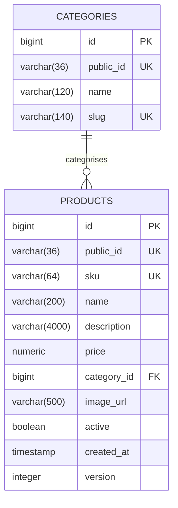

# catalog-service

> ✅ **Implemented.** This document describes running code. Schema comes from
> `V1__create_catalog_tables.sql`, endpoints from `ProductController`.

Product catalog: products, categories and product search. The read-heavy front of the
store and the only service a visitor needs in order to browse.

| | |
|---|---|
| **Port** | 8082 |
| **Resources** | `/api/products`, `/api/categories` |
| **Database** | `jdbc:h2:file:./data/catalog` (dev) · `jdbc:h2:mem:catalog-test` (test) |
| **Module** | `services/catalog-service` |
| **Package** | `com.ecommerce.catalog` |
| **Auth** | None yet. Phase 1 makes reads public and writes `ADMIN`-only |

## Responsibilities

**Owns:** products, categories, pricing as displayed in the catalog, product search.

**Does not own:** stock levels (inventory-service), cart contents (cart-service), the
price actually charged (order-service copies it at checkout, so later price changes
never rewrite past orders).

Search lives here as plain SQL rather than in a separate service. Extracting it to
Elasticsearch would be a Phase 5+ decision driven by real need, not by architecture
diagrams.

## Database schema

### `categories`

| Column | Type | Constraints |
|---|---|---|
| `id` | `BIGINT` | PK, `GENERATED BY DEFAULT AS IDENTITY` |
| `public_id` | `VARCHAR(36)` | `NOT NULL`, unique (`uq_categories_public_id`) |
| `name` | `VARCHAR(120)` | `NOT NULL` |
| `slug` | `VARCHAR(140)` | `NOT NULL`, unique (`uq_categories_slug`) |

`slug` is the stable, human-readable key used in API filters (`?category=keyboards`).

### `products`

| Column | Type | Constraints |
|---|---|---|
| `id` | `BIGINT` | PK, `GENERATED BY DEFAULT AS IDENTITY` |
| `public_id` | `VARCHAR(36)` | `NOT NULL`, unique (`uq_products_public_id`) |
| `sku` | `VARCHAR(64)` | `NOT NULL`, unique (`uq_products_sku`) |
| `name` | `VARCHAR(200)` | `NOT NULL` |
| `description` | `VARCHAR(4000)` | nullable |
| `price` | `NUMERIC(19,4)` | `NOT NULL` |
| `category_id` | `BIGINT` | `NOT NULL`, FK → `categories(id)` (`fk_products_category`) |
| `image_url` | `VARCHAR(500)` | nullable |
| `active` | `BOOLEAN` | `NOT NULL`, default `TRUE` |
| `created_at` | `TIMESTAMP` | `NOT NULL` |
| `version` | `INTEGER` | `NOT NULL`, default `0` |

**Indexes:** `ix_products_category (category_id)`, `ix_products_active (active)`.



### Schema notes

- **`active` is a soft delete.** Discontinued products stay in the table so past
  orders can still resolve them, but are excluded from all browsing queries. The seed
  data includes one inactive product precisely so this is exercised.
- **`public_id` is `VARCHAR(36)`, not a native `UUID`.** Oracle has no UUID type, so
  the entity carries `@JdbcTypeCode(SqlTypes.VARCHAR)` on a `java.util.UUID` field.
  Portable, and passes Hibernate's schema validation.
- **`version` is the `@Version` optimistic lock.** Unused in Phase 0 (reads only) but
  present from the start, since adding it later means a migration plus a backfill.
- **`created_at` and `public_id` are assigned in `@PrePersist`**, not by database
  defaults, so an entity has them before the insert returns.
- **`description` is `VARCHAR(4000)`**, not `CLOB`/`TEXT` — 4000 is Oracle's
  `VARCHAR2` ceiling, which keeps the migration portable.

### Migrations

| File | Applies in | Contents |
|---|---|---|
| `db/migration/V1__create_catalog_tables.sql` | all profiles | Both tables, constraints, indexes |
| `db/seed/V900__seed_catalog_data.sql` | **dev only** | 4 categories, 9 products (8 active, 1 inactive) |

`spring.flyway.locations` is `classpath:db/migration` in the base configuration, and
the dev profile adds `classpath:db/seed`. Tests therefore get schema only and build
their own fixtures, so no test can pass because of demo data. `V900` orders the seed
after any real migration added later.

## API endpoints

All responses are `application/json`.

This service owns **two resources** and therefore two paths — `/api/products` and
`/api/categories` — rather than a single `/api/catalog` namespace. Paths name
resources, not services; see [URL conventions](../architecture.md). One controller
per resource: `ProductController` and `CategoryController`.

### `GET /api/products`

Lists **active** products, paginated. Inactive products are never returned.

| Parameter | Type | Default | Notes |
|---|---|---|---|
| `q` | string | — | Case-insensitive substring match on name. Blank is treated as absent |
| `category` | string | — | Category `slug`. Blank is treated as absent |
| `page` | int | `0` | Zero-based. Minimum 0 |
| `size` | int | `20` | Minimum 1, **maximum 100** |
| `sort` | string | `createdAt,desc` | `<field>,<asc\|desc>` |

`sort` accepts only `name`, `price` and `createdAt`. Anything else is a `400` — the
allowlist exists so a caller cannot sort by arbitrary entity properties and probe the
data model. Any direction other than `asc` is treated as `desc`.

```http
GET /api/products?q=tactile&category=keyboards&page=0&size=8&sort=price,asc
```

```json
{
  "content": [
    {
      "id": "a1b2c3d4-0006-4e5f-8a9b-000000000006",
      "sku": "KBD-0002",
      "name": "Tactile 60 Compact",
      "description": "60% layout with a rotary encoder. Same switches, less desk.",
      "price": 149.0,
      "categoryName": "Keyboards",
      "categorySlug": "keyboards",
      "imageUrl": "https://placehold.co/600x400?text=Tactile+60"
    }
  ],
  "page": 0,
  "size": 8,
  "totalElements": 2,
  "totalPages": 1,
  "first": true,
  "last": true
}
```

The envelope is our own `PagedResponse`, not Spring Data's `Page`. `Page`'s JSON
structure is an implementation detail that has changed between versions, and Boot
3.3+ logs a warning saying as much.

Note `"price": 149.0` — Jackson trims the stored scale of 4. Numerically identical;
clients format currency themselves.

### `GET /api/products/{id}`

`{id}` is the product's `public_id` UUID — never the internal `id`.

```http
GET /api/products/a1b2c3d4-0005-4e5f-8a9b-000000000005
```

```json
{
  "id": "a1b2c3d4-0005-4e5f-8a9b-000000000005",
  "sku": "KBD-0001",
  "name": "Tactile 87 Mechanical Keyboard",
  "description": "Tenkeyless, hot-swappable switches, aluminium plate, QMK firmware.",
  "price": 179.0,
  "categoryName": "Keyboards",
  "categorySlug": "keyboards",
  "imageUrl": "https://placehold.co/600x400?text=Tactile+87"
}
```

- `404` if no product has that `public_id`
- `400` if `{id}` is not a valid UUID

Unlike the list endpoint this returns inactive products too, so an order history page
can still resolve a discontinued item.

### `GET /api/categories`

All categories, ordered by name ascending. No pagination — the list is small and
bounded.

```json
[
  { "id": "7c1f5e9a-0002-4a3b-9c2d-000000000002", "name": "Headphones", "slug": "headphones" },
  { "id": "7c1f5e9a-0003-4a3b-9c2d-000000000003", "name": "Keyboards",  "slug": "keyboards" },
  { "id": "7c1f5e9a-0001-4a3b-9c2d-000000000001", "name": "Laptops",    "slug": "laptops" },
  { "id": "7c1f5e9a-0004-4a3b-9c2d-000000000004", "name": "Monitors",   "slug": "monitors" }
]
```

### Response DTOs

| DTO | Fields |
|---|---|
| `ProductResponse` | `id` (public UUID), `sku`, `name`, `description`, `price`, `categoryName`, `categorySlug`, `imageUrl` |
| `CategoryResponse` | `id` (public UUID), `name`, `slug` |
| `PagedResponse<T>` | `content`, `page`, `size`, `totalElements`, `totalPages`, `first`, `last` |

Internal `id` and `version` are never serialized. DTOs also prevent Hibernate from
being asked to resolve a lazy association during response writing.

## Error responses

Every error uses the shared `ApiError` from `common-web`:

```json
{
  "timestamp": "2026-09-19T15:49:30.377763Z",
  "status": 404,
  "error": "Not Found",
  "message": "Product not found: 11111111-2222-3333-4444-555555555555",
  "path": "/api/products/11111111-2222-3333-4444-555555555555",
  "correlationId": "1390a937-3f4f-4124-b1ee-d8ba223774c7",
  "violations": []
}
```

| Status | Cause |
|---|---|
| `400` | Unsupported `sort` field, `size` above 100, malformed UUID |
| `404` | Unknown product `public_id` |
| `500` | Unexpected error. Message is deliberately generic — details go to the log against the `correlationId` |

`correlationId` echoes an inbound `X-Correlation-Id` or is generated, appears in the
`X-Correlation-Id` response header, and is attached to every log line for the request
via the SLF4J MDC.

## Operational endpoints

| Path | Purpose |
|---|---|
| `/actuator/health` | Health check |
| `/actuator/info`, `/actuator/metrics` | Exposed alongside health |
| `/swagger-ui.html` | Interactive API docs |
| `/v3/api-docs` | OpenAPI JSON — the source for generated clients in Phase 1 |
| `/h2-console` | Database console. **Dev profile only** |

H2 console: JDBC URL `jdbc:h2:file:./data/catalog`, user `sa`, blank password. The dev
datasource sets `AUTO_SERVER=TRUE`, so it can be attached while the service runs.

## Events

None. `catalog-service` neither publishes nor consumes Kafka events today.

When Phase 3 arrives it will likely publish `ProductPriceChanged` and
`ProductDiscontinued` — but only if a consumer actually needs them. Publishing events
nobody reads is cost without benefit.

## Configuration

| File | Purpose |
|---|---|
| `application.yml` | Base: `ddl-auto: validate`, `open-in-view: false`, Hikari pool of 5, port 8082, log pattern with correlation ID |
| `application-dev.yml` | File-mode H2, `db/seed` added to Flyway locations, H2 console on, `format_sql` |
| `application-test.yml` | In-memory H2, `db/migration` only |

`spring.profiles.default` is `dev`, so running with no profile set behaves sensibly.

Two settings worth not changing:

- **`ddl-auto: validate`** — Flyway owns the schema. `update` would silently reshape
  tables and hide migration drift.
- **`open-in-view: false`** — keeps the Hibernate session from staying open through
  response rendering, where it would hide N+1 queries behind lazy loads.

## Implementation notes

**N+1 avoidance.** `Product.category` is `LAZY`; the listing query uses
`join fetch p.category` so one statement loads both. With `EAGER`, or without the
fetch join, a page of 20 products would fire 20 extra queries.

**Optional filters in one query.** The repository query uses
`(:query is null or …)` so a null argument disables that predicate, letting a single
query serve every filter combination. The service layer normalizes blank strings to
null first, because browsers send `?q=` as an empty string rather than omitting it.

**Sort allowlist.** `ProductController.parseSort` maps client strings through a
`switch` and throws `IllegalArgumentException` (→ `400`) on anything unrecognised.

## Tests

11 tests, roughly 4 seconds.

| Test | Covers |
|---|---|
| `CatalogServiceApplicationTests` (1) | Context loads — which runs every migration, then has Hibernate validate the entity mappings against the resulting schema |
| `ProductControllerTest` (8) | Inactive products excluded; category filter; case-insensitive search; blank `q` treated as no filter; fetch by public id; internal fields absent from JSON; `ApiError` shape on 404; sort allowlist rejection; page-size ceiling |
| `CategoryControllerTest` (2) | Name ordering; public id and slug exposed, `version` not |

The smoke test earns its place: a typo in a column name fails there rather than at
runtime.

```bash
../../mvnw test          # from services/catalog-service
```

## Planned changes

| Phase | Change |
|---|---|
| 1 | Resource-server security: public reads, `ADMIN`-only writes. Product/category CRUD. Variants, multiple images, brands. Better search |
| 2 | Requests arrive via the gateway rather than directly |
| 3 | Publish catalog events, if a consumer needs them |
| 5 | Elasticsearch — only if SQL search proves genuinely insufficient |
