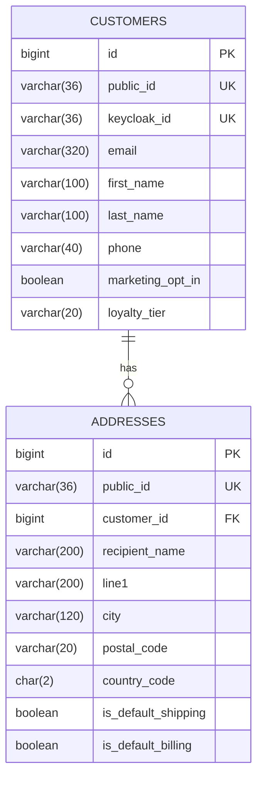

# customer-service

> 🔵 **Planned — Phase 1. Not implemented.** This is a design specification. Nothing
> described here exists yet, and details will change on contact with real code.

Customer profile and addresses. **Deliberately not an auth service** — Keycloak owns
identity entirely.

| | |
|---|---|
| **Port** | 8081 |
| **Base path** | `/api/customers` |
| **Database** | `jdbc:h2:file:./data/customer` |
| **Module** | `services/customer-service` (planned) |
| **Auth** | `CUSTOMER` for own data, `ADMIN` for any |

## Responsibilities

**Owns:** display name, phone, preferences, marketing opt-in, shipping and billing
addresses, loyalty tier.

**Does not own — Keycloak does:** credentials, password policy and reset, tokens,
roles and group membership, login UI, MFA, social login, sessions.

No password hash, no token table, no role table lives here. That is the whole point
of the split.

### Why this service exists at all

The tempting simplification is deleting it and storing profile data in Keycloak user
attributes. That is the one trap in this design:

- Keycloak attributes are **flat key-value strings**. A customer with three addresses
  becomes `address_1_line1`, `address_2_line1`, … — unqueryable and unvalidatable.
- No foreign keys, so nothing can reference an address properly.
- Every read becomes an authenticated call to Keycloak's Admin REST API, making the
  identity provider a hard runtime dependency of checkout.

Keeping the domain's customer record separate from the IdP's identity record is the
standard production pattern. Two tables is a cheap price for the boundary.

## Database schema

### `customers`

| Column | Type | Constraints |
|---|---|---|
| `id` | `BIGINT` | PK, identity |
| `public_id` | `VARCHAR(36)` | `NOT NULL`, unique |
| `keycloak_id` | `VARCHAR(36)` | `NOT NULL`, unique — Keycloak's `sub` claim |
| `email` | `VARCHAR(320)` | `NOT NULL`. Denormalized copy for display/search |
| `first_name` | `VARCHAR(100)` | nullable |
| `last_name` | `VARCHAR(100)` | nullable |
| `phone` | `VARCHAR(40)` | nullable |
| `marketing_opt_in` | `BOOLEAN` | `NOT NULL`, default `FALSE` |
| `loyalty_tier` | `VARCHAR(20)` | `NOT NULL`, default `'STANDARD'` |
| `created_at` | `TIMESTAMP` | `NOT NULL` |
| `updated_at` | `TIMESTAMP` | `NOT NULL` |
| `version` | `INTEGER` | `NOT NULL`, default `0` |

### `addresses`

| Column | Type | Constraints |
|---|---|---|
| `id` | `BIGINT` | PK, identity |
| `public_id` | `VARCHAR(36)` | `NOT NULL`, unique |
| `customer_id` | `BIGINT` | `NOT NULL`, FK → `customers(id)` |
| `label` | `VARCHAR(60)` | nullable — "Home", "Office" |
| `recipient_name` | `VARCHAR(200)` | `NOT NULL` |
| `line1` | `VARCHAR(200)` | `NOT NULL` |
| `line2` | `VARCHAR(200)` | nullable |
| `city` | `VARCHAR(120)` | `NOT NULL` |
| `region` | `VARCHAR(120)` | nullable — state/province |
| `postal_code` | `VARCHAR(20)` | `NOT NULL` |
| `country_code` | `CHAR(2)` | `NOT NULL` — ISO 3166-1 alpha-2 |
| `phone` | `VARCHAR(40)` | nullable |
| `is_default_shipping` | `BOOLEAN` | `NOT NULL`, default `FALSE` |
| `is_default_billing` | `BOOLEAN` | `NOT NULL`, default `FALSE` |
| `created_at` | `TIMESTAMP` | `NOT NULL` |
| `version` | `INTEGER` | `NOT NULL`, default `0` |

**Indexes:** `ix_addresses_customer (customer_id)`, unique on `customers(keycloak_id)`.

### Schema notes

- **`keycloak_id` is the real key.** Never key customer data on email — Keycloak lets
  users change theirs. The `email` column is a denormalized copy for display and
  admin search, refreshed from token claims.
- **Addresses are never hard-deleted while referenced by an order.** They are not
  referenced: `order-service` copies address values into the order. So deletion here
  is safe, and that is deliberate design rather than luck.
- **`country_code` as `CHAR(2)`** keeps shipping-rule logic simple later.

## API endpoints

### `GET /api/customers/me`

The current customer, resolved from the JWT's `sub`. **Just-in-time provisioning:**
if no row exists for that `sub`, create one from token claims (`sub`, `email`,
`given_name`, `family_name`) and return it. Simpler and more self-healing than
Keycloak webhooks or SPI event listeners.

### `PATCH /api/customers/me`

Update own profile. Accepts `firstName`, `lastName`, `phone`, `marketingOptIn`.
Email and roles are **not** editable here — those live in Keycloak's account console.

### Addresses

| Method | Path | Purpose |
|---|---|---|
| `GET` | `/api/customers/me/addresses` | List own addresses |
| `POST` | `/api/customers/me/addresses` | Add one. `201` + `Location` |
| `GET` | `/api/customers/me/addresses/{id}` | Fetch one by public id |
| `PUT` | `/api/customers/me/addresses/{id}` | Replace |
| `DELETE` | `/api/customers/me/addresses/{id}` | Remove. `204` |
| `PUT` | `/api/customers/me/addresses/{id}/default-shipping` | Set default, clearing any previous |

### Admin

| Method | Path | Purpose |
|---|---|---|
| `GET` | `/api/customers?email=&page=&size=` | Search. `ADMIN` only |
| `GET` | `/api/customers/{publicId}` | Fetch any. `ADMIN` only |

## Error responses

Shared `ApiError`. Beyond the usual:

| Status | Cause |
|---|---|
| `403` | Attempt to access another customer's data without `ADMIN` |
| `404` | Unknown address public id, or unknown customer for an admin lookup |
| `409` | Concurrent profile update lost the optimistic lock |

**Ownership must be enforced server-side on every address operation.** Deriving the
customer from the JWT rather than from a request parameter is what prevents one
customer reading another's addresses — the most obvious vulnerability this service
could have.

## Events

**Publishes** (Phase 3, via outbox):

| Event | When | Consumers |
|---|---|---|
| `CustomerRegistered` | JIT provisioning creates a row | notification-service (welcome email) |
| `CustomerProfileUpdated` | Profile changes | — |

**Consumes:** none initially.

## Decisions deferred

- **Whether `CustomerRegistered` is worth publishing** before a consumer exists.
- **Address validation** — a real validation API, or format checks only.
- **Soft vs. hard delete** for customers, once GDPR-style deletion is considered.
- **Whether admin search needs more than email** — deferred until the admin UI exists.
