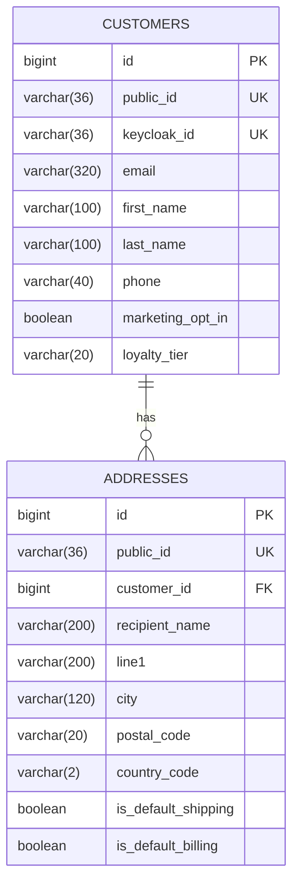

# customer-service

> ✅ **Implemented.** This document describes running code. Schema comes from
> `V1__create_customer_tables.sql`, endpoints from `CustomerController` and
> `AddressController`.

Customer profile and addresses. **Deliberately not an auth service** — Keycloak owns
identity entirely.

| | |
|---|---|
| **Port** | 8081 |
| **Resources** | `/api/customers`, `/api/customers/me/addresses` |
| **Database** | `jdbc:h2:file:./data/customer` (dev) · `jdbc:h2:mem:customer-test` (test) |
| **Module** | `services/customer-service` |
| **Package** | `com.ecommerce.customer` |
| **Auth** | Every endpoint requires a valid JWT. `ADMIN` for cross-customer access |

## Responsibilities

**Owns:** display name, phone, preferences, marketing opt-in, shipping and billing
addresses, loyalty tier.

**Does not own — Keycloak does:** credentials, password policy and reset, tokens,
roles and group membership, login UI, MFA, social login, sessions.

No password hash, no token table, no role table lives here. That is the whole point
of the split.

### Why this service exists at all

The tempting simplification is deleting it and storing profile data in Keycloak user
attributes. That is the one trap in this design:

- Keycloak attributes are **flat key-value strings**. A customer with three addresses
  becomes `address_1_line1`, `address_2_line1`, … — unqueryable and unvalidatable.
- No foreign keys, so nothing can reference an address properly.
- Every read becomes an authenticated call to Keycloak's Admin REST API, making the
  identity provider a hard runtime dependency of checkout.

Keeping the domain's customer record separate from the IdP's identity record is the
standard production pattern. Two tables is a cheap price for the boundary.

## Database schema

### `customers`

| Column | Type | Constraints |
|---|---|---|
| `id` | `BIGINT` | PK, identity |
| `public_id` | `VARCHAR(36)` | `NOT NULL`, unique |
| `keycloak_id` | `VARCHAR(36)` | `NOT NULL`, unique — Keycloak's `sub` claim |
| `email` | `VARCHAR(320)` | `NOT NULL`. Denormalized copy for display/search |
| `first_name` | `VARCHAR(100)` | nullable |
| `last_name` | `VARCHAR(100)` | nullable |
| `phone` | `VARCHAR(40)` | nullable |
| `marketing_opt_in` | `BOOLEAN` | `NOT NULL`, default `FALSE` |
| `loyalty_tier` | `VARCHAR(20)` | `NOT NULL`, default `'STANDARD'` |
| `created_at` | `TIMESTAMP` | `NOT NULL` |
| `updated_at` | `TIMESTAMP` | `NOT NULL` |
| `version` | `INTEGER` | `NOT NULL`, default `0` |

### `addresses`

| Column | Type | Constraints |
|---|---|---|
| `id` | `BIGINT` | PK, identity |
| `public_id` | `VARCHAR(36)` | `NOT NULL`, unique |
| `customer_id` | `BIGINT` | `NOT NULL`, FK → `customers(id)` |
| `label` | `VARCHAR(60)` | nullable — "Home", "Office" |
| `recipient_name` | `VARCHAR(200)` | `NOT NULL` |
| `line1` | `VARCHAR(200)` | `NOT NULL` |
| `line2` | `VARCHAR(200)` | nullable |
| `city` | `VARCHAR(120)` | `NOT NULL` |
| `region` | `VARCHAR(120)` | nullable — state/province |
| `postal_code` | `VARCHAR(20)` | `NOT NULL` |
| `country_code` | `CHAR(2)` | `NOT NULL` — ISO 3166-1 alpha-2 |
| `phone` | `VARCHAR(40)` | nullable |
| `is_default_shipping` | `BOOLEAN` | `NOT NULL`, default `FALSE` |
| `is_default_billing` | `BOOLEAN` | `NOT NULL`, default `FALSE` |
| `created_at` | `TIMESTAMP` | `NOT NULL` |
| `version` | `INTEGER` | `NOT NULL`, default `0` |

**Indexes:** `ix_addresses_customer (customer_id)`, unique on `customers(keycloak_id)`.



### Schema notes

- **`keycloak_id` is the real key.** Never key customer data on email — Keycloak lets
  users change theirs. The `email` column is a denormalized copy for display and
  admin search, refreshed from token claims.
- **Addresses are never hard-deleted while referenced by an order.** They are not
  referenced: `order-service` copies address values into the order. So deletion here
  is safe, and that is deliberate design rather than luck.
- **`country_code` is `VARCHAR(2)`, not `CHAR(2)`.** Hibernate maps `String` to
  VARCHAR and `ddl-auto: validate` compares declared types, so a CHAR column fails
  validation at startup. The entity uppercases on the way in, so `gb` and `GB` are
  stored identically.
- **`keycloak_id` is a `String` in Java, not a `UUID`.** OIDC defines `sub` as an
  opaque identifier. Keycloak's is UUID-shaped today, but federation or another
  provider can return something else, and parsing a value you never interpret only
  creates a way to fail.
- **`uq_customers_keycloak_id` is load-bearing.** It is what makes just-in-time
  provisioning safe under concurrency — see the note on `GET /me` below.

## API endpoints

### `GET /api/customers/me`

The current customer, resolved from the JWT's `sub`. **Just-in-time provisioning:**
if no row exists for that `sub`, one is created from token claims (`sub`, `email`,
`given_name`, `family_name`). Simpler and more self-healing than Keycloak webhooks or
SPI event listeners. On every call the name and email are refreshed from the token, so
a change made in Keycloak's account console does not leave this copy stale.

```json
{
  "id": "aff2173f-09b6-41e2-b47e-49644f004269",
  "email": "customer@test.local",
  "firstName": "Test",
  "lastName": "Customer",
  "phone": null,
  "marketingOptIn": false,
  "loyaltyTier": "STANDARD",
  "createdAt": "2026-09-20T18:27:16.749909Z"
}
```

`keycloakId` is deliberately absent from the response: exposing another system's user
identifier invites clients to key their own data on it.

**`CustomerService.resolveCurrent` is deliberately not `@Transactional`.** Two
concurrent first requests can both find nothing and both insert; the unique constraint
rejects one. Recovery means re-reading, but a transaction that has just taken a
constraint violation is marked rollback-only, so a read inside it would fail too.
Leaving the method non-transactional gives each repository call its own short
transaction, and the retry succeeds. (Extracting a `@Transactional` private method
would not help — self-invocation bypasses the proxy, so the annotation is ignored.)

### `PATCH /api/customers/me`

Update own profile. Accepts `firstName`, `lastName`, `phone`, `marketingOptIn`;
**omitted fields are left unchanged**. Email and roles are not editable here — those
live in Keycloak's account console.

`marketingOptIn` is a boxed `Boolean` in the request DTO. A primitive would default to
`false` when omitted and silently opt the customer out of marketing they had agreed to.

### Addresses

| Method | Path | Purpose |
|---|---|---|
| `GET` | `/api/customers/me/addresses` | List own addresses |
| `POST` | `/api/customers/me/addresses` | Add one. `201` + `Location` |
| `GET` | `/api/customers/me/addresses/{id}` | Fetch one by public id |
| `PUT` | `/api/customers/me/addresses/{id}` | Replace |
| `DELETE` | `/api/customers/me/addresses/{id}` | Remove. `204` |
| `PUT` | `/api/customers/me/addresses/{id}/default-shipping` | Set default, clearing any previous |
| `PUT` | `/api/customers/me/addresses/{id}/default-billing` | Same, for billing |

Ownership is structural rather than remembered: the repository exposes
`findByPublicIdAndCustomer_KeycloakId(...)` and no plain `findByPublicId`, so a query
scoped to the wrong customer simply returns nothing. Setting a default clears the
previous one first; if the target id turns out to be unknown, the resulting exception
rolls the transaction back, so a bad request cannot leave a customer with no default
at all.

### Admin

| Method | Path | Purpose |
|---|---|---|
| `GET` | `/api/customers?email=&page=&size=` | Search. `ADMIN` only |
| `GET` | `/api/customers/{publicId}` | Fetch any. `ADMIN` only |

## Error responses

Shared `ApiError`. Beyond the usual:

| Status | Cause |
|---|---|
| `400` | Validation failure. `violations[]` names each field |
| `401` | Missing, expired or malformed token |
| `403` | Valid token without the required role |
| `404` | Unknown address or customer — **also** what you get for another customer's address |
| `409` | Concurrent profile update lost the optimistic lock |

**Another customer's address returns 404, not 403.** A 403 would confirm the id
exists, which leaks information about other customers' data.

Returning 403 rather than 500 for an authorization failure required a fix in
`common-web`: `GlobalExceptionHandler`'s catch-all `@ExceptionHandler(Exception.class)`
was swallowing Spring Security's `AuthorizationDeniedException`. `SecurityExceptionHandler`
now sits at `HIGHEST_PRECEDENCE` ahead of it.

## Security configuration

| Piece | Where |
|---|---|
| Filter chain, stateless, CSRF off, actuator/OpenAPI public | `config/SecurityConfig` |
| `@EnableMethodSecurity`, enabling `@PreAuthorize` | `config/SecurityConfig` |
| `realm_access.roles` → `ROLE_`-prefixed authorities | `common-web`'s `KeycloakRealmRoleConverter` |
| `issuer-uri` | `application.yml`, matching `KC_HOSTNAME` |

The role converter lives in `common-web` so future services inherit it, with the
security dependency marked `optional` — otherwise catalog-service would inherit
Spring Security transitively, auto-configure it, and start returning 401 for product
listings.

Tests never start Keycloak. They use `spring-security-test`'s `jwt()` post-processor,
and the test profile sets `jwk-set-uri` instead of `issuer-uri` so the decoder is
built without contacting anything.

## Tests

28 tests across four classes, about 4 seconds.

| Class | Covers |
|---|---|
| `CustomerServiceApplicationTests` | Context loads; migration runs; entity mappings validate |
| `CustomerRepositoryTest` (6) | Lookup by `sub` and public id, duplicate-`sub` rejection, case-insensitive email search |
| `AddressRepositoryTest` (9) | Owner scoping, cross-customer isolation, default clearing, country-code normalisation |
| `CustomerControllerTest` (10) | 401 anonymous, provisioning, PATCH semantics, 403 without `ADMIN` |
| `AddressControllerTest` (13) | CRUD, validation, and cross-customer access denial |

## Events

**Not implemented.** Nothing is published or consumed today — Kafka arrives in Phase 3.

Planned (via outbox):

| Event | When | Consumers |
|---|---|---|
| `CustomerRegistered` | JIT provisioning creates a row | notification-service (welcome email) |
| `CustomerProfileUpdated` | Profile changes | — |

**Consumes:** none initially.

## Decisions deferred

- **Whether `CustomerRegistered` is worth publishing** before a consumer exists.
- **Address validation** — a real validation API, or format checks only.
- **Soft vs. hard delete** for customers, once GDPR-style deletion is considered.
- **Whether admin search needs more than email** — deferred until the admin UI exists.
