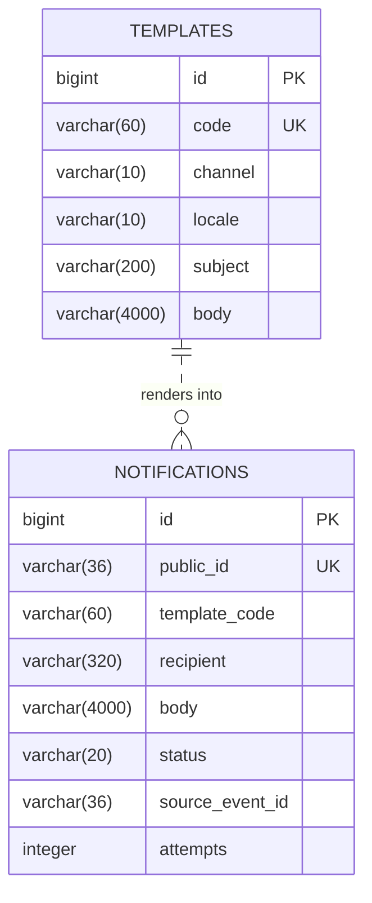

# notification-service

> 🔵 **Planned — Phase 3. Not implemented.** This is a design specification. Nothing
> described here exists yet, and details will change on contact with real code.

Transactional email and SMS, driven entirely by events.

| | |
|---|---|
| **Port** | 8087 |
| **Base path** | `/api/notifications` (admin/read only) |
| **Database** | `jdbc:h2:file:./data/notification` |
| **Module** | `services/notification-service` (planned) |
| **Auth** | `ADMIN` only — no customer-facing write API |

## Responsibilities

**Owns:** message templates, rendering, delivery attempts, and the delivery log.

**Does not own:** any business decision about *whether* something happened. It reacts
to events; it never asks another service for state.

**Event-driven only — no synchronous send API.** This is the design constraint that
matters. If `order-service` called `POST /api/notifications` inline, a slow SMTP
server would slow checkout, and an unavailable notification service would fail
orders. Nobody should ever be unable to buy something because an email queue is
backed up.

It is also the first service where being a pure consumer is the natural shape, which
makes it a good place to practise idempotent consumers without business logic in the
way.

**If time is short, this is the service to drop** (PLAN.md §10) — log instead of send.
Nothing else depends on it.

## Delivery model

In development, **no real messages are sent.** Delivery goes to one of:

| Mode | Behaviour |
|---|---|
| `log` | Render and write to the log. The default |
| `file` | Write rendered messages to `./data/notifications/` for inspection |
| `smtp` | A local catch-all SMTP container (MailHog/Mailpit) with a web inbox |

Sending real email from a learning project earns nothing and risks a deliverability
mess. A catch-all inbox gives the full experience — rendered HTML, subject lines,
recipients — with no way to reach a real person by accident.

## Database schema

### `templates`

| Column | Type | Constraints |
|---|---|---|
| `id` | `BIGINT` | PK, identity |
| `code` | `VARCHAR(60)` | `NOT NULL`, unique — e.g. `ORDER_CONFIRMED` |
| `channel` | `VARCHAR(10)` | `NOT NULL` — `EMAIL`, `SMS` |
| `locale` | `VARCHAR(10)` | `NOT NULL`, default `'en'` |
| `subject` | `VARCHAR(200)` | nullable — email only |
| `body` | `VARCHAR(4000)` | `NOT NULL` — template with placeholders |
| `active` | `BOOLEAN` | `NOT NULL`, default `TRUE` |
| `updated_at` | `TIMESTAMP` | `NOT NULL` |
| `version` | `INTEGER` | `NOT NULL`, default `0` |

**Constraint:** unique `(code, channel, locale)`.

Templates in the database rather than in resource files, so wording can change
without a redeploy — and so a `locale` dimension exists from the start, since
retrofitting one is tedious.

### `notifications`

| Column | Type | Constraints |
|---|---|---|
| `id` | `BIGINT` | PK, identity |
| `public_id` | `VARCHAR(36)` | `NOT NULL`, unique |
| `template_code` | `VARCHAR(60)` | `NOT NULL` |
| `channel` | `VARCHAR(10)` | `NOT NULL` |
| `recipient` | `VARCHAR(320)` | `NOT NULL` — email or phone |
| `customer_id` | `VARCHAR(36)` | nullable — Keycloak `sub` |
| `subject` | `VARCHAR(200)` | nullable — rendered |
| `body` | `VARCHAR(4000)` | `NOT NULL` — rendered, as sent |
| `status` | `VARCHAR(20)` | `NOT NULL` — `PENDING`, `SENT`, `FAILED`, `SUPPRESSED` |
| `attempts` | `INTEGER` | `NOT NULL`, default `0` |
| `last_error` | `VARCHAR(500)` | nullable |
| `source_event_id` | `VARCHAR(36)` | `NOT NULL` — event that triggered it |
| `correlation_id` | `VARCHAR(36)` | nullable |
| `created_at` | `TIMESTAMP` | `NOT NULL` |
| `sent_at` | `TIMESTAMP` | nullable |

**Indexes:** `ix_notifications_customer (customer_id, created_at DESC)`,
`ix_notifications_retry (status, attempts)`, unique on `source_event_id` per
`template_code`.

Two things worth noting:

- **The rendered body is stored, not just the template reference.** "What exactly did
  we tell this customer?" is a question that gets asked, and re-rendering later
  against a changed template gives the wrong answer.
- **`source_event_id` with a unique constraint** is the idempotency guard. Kafka
  redelivery must not mean a second confirmation email. Doing this at the database
  level rather than in application logic is what makes it actually reliable.

`SUPPRESSED` covers a marketing opt-out or a known-bad address — distinct from
`FAILED`, because it needs no retry.

### `processed_events`

| Column | Type | Constraints |
|---|---|---|
| `event_id` | `VARCHAR(36)` | PK |
| `event_type` | `VARCHAR(50)` | `NOT NULL` |
| `processed_at` | `TIMESTAMP` | `NOT NULL` |

There is no foreign key from `notifications` to `templates` — a notification must
remain readable after a template is deleted.

## API endpoints

Read and administration only. **There is deliberately no send endpoint.**

| Method | Path | Auth | Purpose |
|---|---|---|---|
| `GET` | `/api/notifications?customerId=&status=&page=` | `ADMIN` | Search the delivery log |
| `GET` | `/api/notifications/{id}` | `ADMIN` | One notification, as rendered |
| `POST` | `/api/notifications/{id}/retry` | `ADMIN` | Retry a failed delivery |
| `GET` | `/api/notifications/templates` | `ADMIN` | List templates |
| `GET` | `/api/notifications/templates/{code}` | `ADMIN` | Fetch one |
| `PUT` | `/api/notifications/templates/{code}` | `ADMIN` | Update wording |
| `POST` | `/api/notifications/templates/{code}/preview` | `ADMIN` | Render with sample data, without sending |

Preview matters: template editing with no way to check the result means finding
mistakes in a customer's inbox.

## Events

**Consumes** — this is the service's entire input:

| Event | Template | Channel |
|---|---|---|
| `CustomerRegistered` | `WELCOME` | Email |
| `OrderConfirmed` | `ORDER_CONFIRMED` | Email |
| `OrderCancelled` | `ORDER_CANCELLED` | Email |
| `OrderFailed` | `ORDER_FAILED` | Email |
| `OrderShipped` | `ORDER_SHIPPED` | Email + SMS |
| `PaymentFailed` | `PAYMENT_FAILED` | Email |
| `RefundIssued` | `REFUND_ISSUED` | Email |
| `CartAbandoned` | `CART_ABANDONED` | Email — **respects `marketingOptIn`** |
| `LowStockDetected` | `LOW_STOCK_ALERT` | Email to ops |

**Publishes:**

| Event | When |
|---|---|
| `NotificationSent` | Delivery succeeded |
| `NotificationFailed` | Retries exhausted |

Both are mostly for observability; nothing currently consumes them, which is a good
reason to question whether they are worth publishing at all.

### Recipient addresses come from the event

Events carry the recipient (`customer_email` is copied onto every order for exactly
this reason). Calling customer-service to look up an address would reintroduce the
synchronous coupling this service exists to avoid — and would break replay, since a
replayed event should render against the address that was current then.

## Retry policy

Exponential backoff, bounded attempts, then `FAILED` and a manual retry endpoint.
Transient SMTP failures are normal and must not lose the message; infinite retries
against a permanently bad address are just noise.

## Decisions deferred

- **Whether SMS is in scope at all**, given it needs a real provider even in dev.
- **Template engine** — Thymeleaf, Mustache, or plain string substitution.
- **Retry counts and backoff intervals.**
- **Whether `CartAbandoned` is wanted**, which is marketing rather than transactional
  and brings consent handling with it.
- **Whether to keep this service** or fold logging into the publishers if time is short.
- **Digest batching** for ops alerts like `LOW_STOCK_ALERT`, to avoid one email per
  event.
