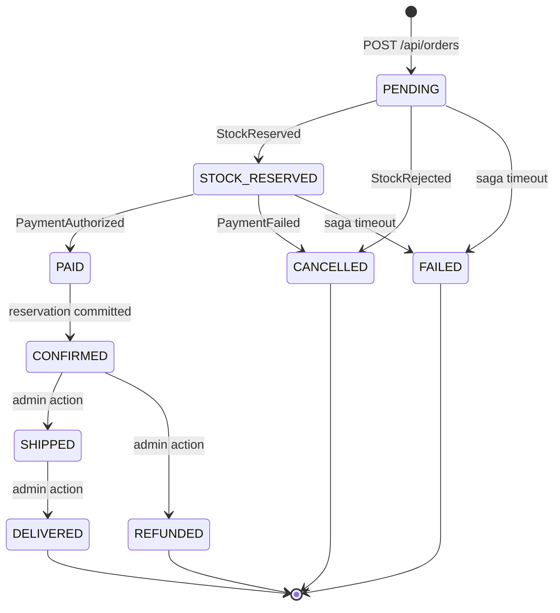
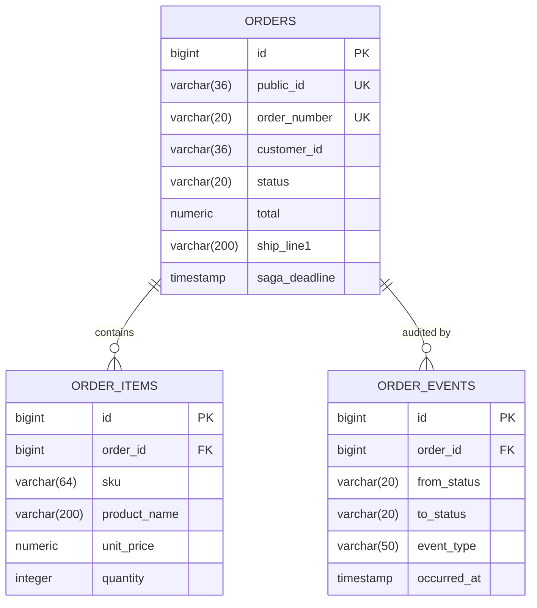

# order-service

> 🔵 **Planned — Phase 2 (synchronous) then Phase 3 (saga). Not implemented.** This is
> a design specification. Nothing described here exists yet, and details will change
> on contact with real code.

Orders and the checkout saga. **The centrepiece of the project** — the service where
distributed-transaction patterns are actually learned.

| | |
|---|---|
| **Port** | 8085 |
| **Base path** | `/api/orders` |
| **Database** | `jdbc:h2:file:./data/order` |
| **Module** | `services/order-service` (planned) |
| **Auth** | `CUSTOMER` for own orders, `ADMIN` for all |

## Responsibilities

**Owns:** orders, order lines, the order state machine, and **orchestration of the
checkout saga**.

**Does not own:** stock (inventory-service), payment execution (payment-service),
customer profile (customer-service).

**Orchestration over choreography** — deliberately. `order-service` tells the other
services what to do rather than everyone reacting to everyone. Choreography is more
decoupled in theory; orchestration gives one place to look when an order is stuck,
and one state machine to reason about. For a learning project where the goal is
*understanding* distributed transactions, that visibility is worth more than the
purity.

## Built twice, on purpose

| Phase | Implementation |
|---|---|
| 2 | Synchronous REST calls to inventory and payment inside one request |
| 3 | Transactional outbox + event-driven saga with compensation |

Phase 2 is knowingly fragile: a timeout mid-checkout leaves stock reserved and no
order. **Feeling that failure is the point** — it is what makes the outbox and
compensation logic in Phase 3 read as necessary rather than as ceremony.

## Order state machine



Transitions are validated in code — an illegal transition throws rather than writing
a nonsensical state. Every transition is appended to `order_events`.

**Saga timeout is mandatory.** A scheduled job moves orders stuck in `PENDING` or
`STOCK_RESERVED` past a deadline to `FAILED` and triggers compensation. Without it,
one dropped Kafka message leaves an order hung forever and stock reserved forever.

## Database schema

### `orders`

| Column | Type | Constraints |
|---|---|---|
| `id` | `BIGINT` | PK, identity |
| `public_id` | `VARCHAR(36)` | `NOT NULL`, unique |
| `order_number` | `VARCHAR(20)` | `NOT NULL`, unique — human-readable, e.g. `ORD-2026-00042` |
| `customer_id` | `VARCHAR(36)` | `NOT NULL` — Keycloak `sub` |
| `customer_email` | `VARCHAR(320)` | `NOT NULL` — **copied** at checkout |
| `status` | `VARCHAR(20)` | `NOT NULL` |
| `currency` | `CHAR(3)` | `NOT NULL` |
| `subtotal` | `NUMERIC(19,4)` | `NOT NULL` |
| `shipping_cost` | `NUMERIC(19,4)` | `NOT NULL`, default `0` |
| `tax_amount` | `NUMERIC(19,4)` | `NOT NULL`, default `0` |
| `total` | `NUMERIC(19,4)` | `NOT NULL` |
| `ship_recipient_name` | `VARCHAR(200)` | `NOT NULL` |
| `ship_line1` | `VARCHAR(200)` | `NOT NULL` |
| `ship_line2` | `VARCHAR(200)` | nullable |
| `ship_city` | `VARCHAR(120)` | `NOT NULL` |
| `ship_region` | `VARCHAR(120)` | nullable |
| `ship_postal_code` | `VARCHAR(20)` | `NOT NULL` |
| `ship_country_code` | `CHAR(2)` | `NOT NULL` |
| `placed_at` | `TIMESTAMP` | `NOT NULL` |
| `updated_at` | `TIMESTAMP` | `NOT NULL` |
| `saga_deadline` | `TIMESTAMP` | nullable — null once terminal |
| `version` | `INTEGER` | `NOT NULL`, default `0` |

**The shipping address is copied, not referenced.** The single most important
modelling decision here: an order records what was agreed at a point in time. If it
held a foreign key to `addresses`, editing your address next month would silently
rewrite last month's orders. The same reasoning applies to `customer_email` and to
every price on every line.

`total` is stored rather than computed, because it is the number the customer was
charged — it must survive any later change to tax or shipping rules.

### `order_items`

| Column | Type | Constraints |
|---|---|---|
| `id` | `BIGINT` | PK, identity |
| `order_id` | `BIGINT` | `NOT NULL`, FK → `orders(id)` |
| `product_id` | `VARCHAR(36)` | `NOT NULL` |
| `sku` | `VARCHAR(64)` | `NOT NULL` |
| `product_name` | `VARCHAR(200)` | `NOT NULL` — copied |
| `unit_price` | `NUMERIC(19,4)` | `NOT NULL` — copied |
| `quantity` | `INTEGER` | `NOT NULL`, `CHECK > 0` |
| `line_total` | `NUMERIC(19,4)` | `NOT NULL` |

No foreign key to catalog-service. A product renamed or discontinued must not change
what an old order says was bought.

### `order_events`

Append-only audit trail and the primary debugging tool.

| Column | Type | Constraints |
|---|---|---|
| `id` | `BIGINT` | PK, identity |
| `order_id` | `BIGINT` | `NOT NULL`, FK → `orders(id)` |
| `from_status` | `VARCHAR(20)` | nullable — null for creation |
| `to_status` | `VARCHAR(20)` | `NOT NULL` |
| `event_type` | `VARCHAR(50)` | `NOT NULL` |
| `detail` | `VARCHAR(1000)` | nullable — failure reason, correlation id |
| `occurred_at` | `TIMESTAMP` | `NOT NULL` |

"Why is order 42 stuck?" is answered by one query against this table. It is also the
best thing to show when demonstrating the project.

### Saga plumbing

| Table | Columns | Purpose |
|---|---|---|
| `outbox` | `id`, `aggregate_id`, `event_type`, `payload`, `created_at`, `published_at` | Business change and event written in one transaction; a poller publishes |
| `processed_events` | `event_id` (PK) | Idempotency guard against Kafka redelivery |

**Indexes:** `ix_orders_customer (customer_id, placed_at DESC)`,
`ix_orders_saga (status, saga_deadline)`, `ix_outbox_unpublished (published_at)`.



## API endpoints

| Method | Path | Auth | Purpose |
|---|---|---|---|
| `POST` | `/api/orders` | `CUSTOMER` | Place an order. **`202 Accepted`** |
| `GET` | `/api/orders` | `CUSTOMER` | Own order history, paginated |
| `GET` | `/api/orders/{id}` | `CUSTOMER` | One order with items and timeline |
| `GET` | `/api/orders/{id}/status` | `CUSTOMER` | **SSE stream** of live status |
| `POST` | `/api/orders/{id}/cancel` | `CUSTOMER` | Cancel while cancellable |
| `GET` | `/api/orders/admin?status=&customerId=` | `ADMIN` | Search all orders |
| `POST` | `/api/orders/{id}/transition` | `ADMIN` | Manual state override |
| `GET` | `/api/orders/admin/stuck` | `ADMIN` | Non-terminal past deadline |

### `POST /api/orders` returns `202`, not `201`

The order exists, but the saga has not finished. Returning `201` with a `CONFIRMED`
status would be a lie, and returning `200` only after the saga completes would make
checkout as slow as its slowest participant.

```json
{
  "id": "…",
  "orderNumber": "ORD-2026-00042",
  "status": "PENDING",
  "total": 358.0,
  "statusUrl": "/api/orders/…/status"
}
```

**This shapes the frontend.** Checkout shows "order received, processing" and then
resolves — don't build UI that assumes a synchronous success or failure.

### `GET /api/orders/{id}/status` (SSE)

Streams transitions as they happen, so the saga is visible in the UI while it runs.
Per PLAN.md, the single best demo feature in the project — the abstract becomes
watchable.

```
event: status
data: {"status":"STOCK_RESERVED","at":"2026-09-19T12:00:01Z"}

event: status
data: {"status":"CONFIRMED","at":"2026-09-19T12:00:03Z"}
```

## Error responses

| Status | Cause |
|---|---|
| `400` | Empty order, invalid address, unparseable ids |
| `403` | Another customer's order without `ADMIN` |
| `404` | Unknown order |
| `409` | Illegal state transition, e.g. cancelling a `SHIPPED` order |
| `422` | Cart validation failed — price moved or stock insufficient |

## Events

**Publishes** (all via outbox):

| Event | When | Consumers |
|---|---|---|
| `OrderCreated` | Order persisted as `PENDING` | inventory-service |
| `OrderConfirmed` | Payment committed | notification, cart |
| `OrderCancelled` | Compensation ran | inventory, payment, notification |
| `OrderFailed` | Saga timed out | inventory, notification |
| `OrderShipped` | Admin marked shipped | notification |

**Consumes:**

| Event | Action |
|---|---|
| `StockReserved` | → `STOCK_RESERVED`, request payment |
| `StockRejected` | → `CANCELLED` |
| `PaymentAuthorized` | → `PAID`, commit reservation |
| `PaymentFailed` | → compensate, `CANCELLED` |

## Decisions deferred

- **Order-number generation** — a sequence is simplest, but leaks volume. A prefixed
  random suffix avoids that.
- **Saga deadline duration.**
- **Partial fulfilment** — currently all-or-nothing per order.
- **Tax and shipping calculation** — flat rate first; a rules engine is scope creep.
- **Whether cancellation is allowed after `CONFIRMED`** but before `SHIPPED`, and
  whether that triggers an automatic refund.
- **SSE vs. WebSocket vs. polling** for live status. SSE is simplest and one-way,
  which fits.
