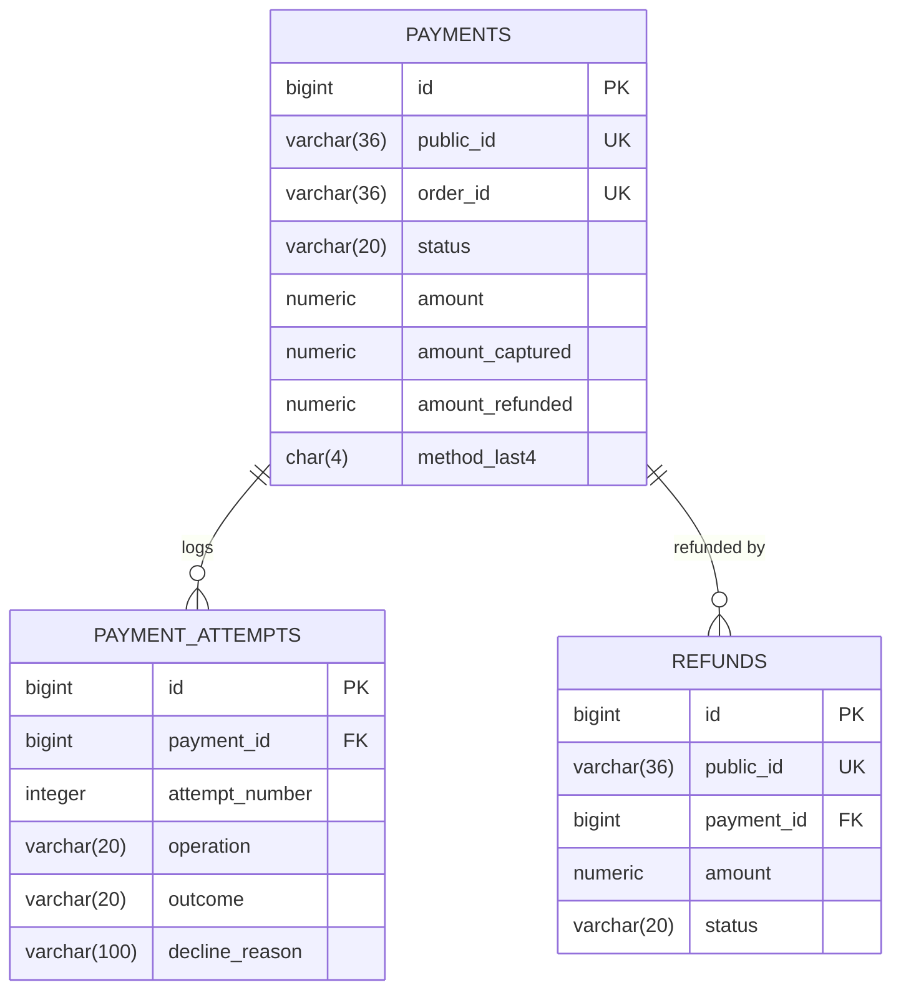

# payment-service

> 🔵 **Planned — Phase 2 (stub) then Phase 3 (saga participant). Not implemented.**
> This is a design specification. Nothing described here exists yet, and details will
> change on contact with real code.

Payment authorization, capture and refunds — against a **simulated gateway**.

| | |
|---|---|
| **Port** | 8086 |
| **Base path** | `/api/payments` |
| **Database** | `jdbc:h2:file:./data/payment` |
| **Module** | `services/payment-service` (planned) |
| **Auth** | `CUSTOMER` for own payments, `ADMIN` for all |

## Scope: simulated, and that is deliberate

**No real money moves. No card data is ever stored, logged or transmitted.**

Real payment processing means PCI DSS compliance, which is an enormous topic with
nothing to teach about microservices. The simulated gateway instead gives something
more useful for this project: **controllable failure**. You can make payments fail on
demand, which is the only practical way to exercise saga compensation.

If this ever became real, the integration pattern would be a hosted
checkout/payment-intent flow where card details go from the browser straight to the
provider and this service only ever sees a token — the same shape as below, which is
why the design is worth getting right even simulated.

| Simulated trigger | Outcome |
|---|---|
| Amount ending `.01` | Declined — insufficient funds |
| Amount ending `.02` | Declined — card expired |
| Amount ending `.03` | Gateway timeout (tests saga timeout) |
| Configured delay | Slow authorization (tests circuit breaker) |
| Anything else | Authorized |

## Responsibilities

**Owns:** payment intents, authorization attempts, captures, refunds, and the
simulated gateway's decisions.

**Does not own:** order state (order-service), stock (inventory-service). It reports
outcomes; it does not decide what an order means.

**Authorize then capture**, not a single charge. Authorization reserves funds;
capture takes them once the order is confirmed. This mirrors how real gateways work
and gives the saga a clean compensation step — voiding an authorization is cheap and
invisible to the customer, whereas refunding a capture is neither.

## Database schema

### `payments`

One row per order. The aggregate.

| Column | Type | Constraints |
|---|---|---|
| `id` | `BIGINT` | PK, identity |
| `public_id` | `VARCHAR(36)` | `NOT NULL`, unique |
| `order_id` | `VARCHAR(36)` | `NOT NULL`, unique — one payment per order |
| `customer_id` | `VARCHAR(36)` | `NOT NULL` — Keycloak `sub` |
| `status` | `VARCHAR(20)` | `NOT NULL` — `PENDING`, `AUTHORIZED`, `CAPTURED`, `FAILED`, `VOIDED`, `REFUNDED`, `PARTIALLY_REFUNDED` |
| `amount` | `NUMERIC(19,4)` | `NOT NULL` |
| `currency` | `CHAR(3)` | `NOT NULL` |
| `amount_captured` | `NUMERIC(19,4)` | `NOT NULL`, default `0` |
| `amount_refunded` | `NUMERIC(19,4)` | `NOT NULL`, default `0` |
| `method_type` | `VARCHAR(20)` | `NOT NULL` — `CARD`, `WALLET` |
| `method_last4` | `CHAR(4)` | nullable — **display only** |
| `method_brand` | `VARCHAR(20)` | nullable — `VISA`, `MASTERCARD` |
| `gateway_reference` | `VARCHAR(64)` | nullable — simulated provider id |
| `created_at` | `TIMESTAMP` | `NOT NULL` |
| `updated_at` | `TIMESTAMP` | `NOT NULL` |
| `version` | `INTEGER` | `NOT NULL`, default `0` |

**What is not here, and never will be:** full card number, CVV, expiry, cardholder
name, or any token that could be replayed. `method_last4` and `method_brand` exist
solely so the UI can say "Visa ending 4242".

`order_id` is unique — a `UNIQUE` constraint is a much stronger guard against double
payment than application logic, especially with Kafka redelivery in play.

### `payment_attempts`

Append-only. Every interaction with the gateway, successful or not.

| Column | Type | Constraints |
|---|---|---|
| `id` | `BIGINT` | PK, identity |
| `payment_id` | `BIGINT` | `NOT NULL`, FK → `payments(id)` |
| `attempt_number` | `INTEGER` | `NOT NULL` |
| `operation` | `VARCHAR(20)` | `NOT NULL` — `AUTHORIZE`, `CAPTURE`, `VOID`, `REFUND` |
| `outcome` | `VARCHAR(20)` | `NOT NULL` — `SUCCESS`, `DECLINED`, `ERROR`, `TIMEOUT` |
| `decline_reason` | `VARCHAR(100)` | nullable |
| `gateway_reference` | `VARCHAR(64)` | nullable |
| `correlation_id` | `VARCHAR(36)` | nullable |
| `attempted_at` | `TIMESTAMP` | `NOT NULL` |

Payments are the thing you will most often be asked to explain after the fact. An
append-only attempt log answers "what did we send and what came back?" — and retries
make an aggregate-only view genuinely misleading.

### `refunds`

| Column | Type | Constraints |
|---|---|---|
| `id` | `BIGINT` | PK, identity |
| `public_id` | `VARCHAR(36)` | `NOT NULL`, unique |
| `payment_id` | `BIGINT` | `NOT NULL`, FK → `payments(id)` |
| `amount` | `NUMERIC(19,4)` | `NOT NULL`, `CHECK > 0` |
| `reason` | `VARCHAR(200)` | nullable |
| `status` | `VARCHAR(20)` | `NOT NULL` — `PENDING`, `COMPLETED`, `FAILED` |
| `requested_by` | `VARCHAR(36)` | `NOT NULL` — admin's `sub` |
| `created_at` | `TIMESTAMP` | `NOT NULL` |

Separate table because refunds are partial and repeatable — `amount_refunded` on the
payment is a running total, not the record.

### Saga plumbing

| Table | Purpose |
|---|---|
| `outbox` | Transactional event publication |
| `processed_events` | Idempotency guard |



## API endpoints

| Method | Path | Auth | Purpose |
|---|---|---|---|
| `POST` | `/api/payments/authorize` | service | Authorize for an order |
| `POST` | `/api/payments/{id}/capture` | service | Capture an authorization |
| `POST` | `/api/payments/{id}/void` | service | Void — the saga's compensation step |
| `GET` | `/api/payments/{id}` | `CUSTOMER` | Own payment detail |
| `GET` | `/api/payments?orderId=` | `CUSTOMER` | Payment for an order |
| `POST` | `/api/payments/{id}/refunds` | `ADMIN` | Issue a full or partial refund |
| `GET` | `/api/payments/{id}/attempts` | `ADMIN` | Attempt log |
| `GET` | `/api/payments/admin?status=` | `ADMIN` | Search |

Authorization is normally driven by the saga rather than called directly. Requests
carry an **idempotency key** so a retry cannot authorize twice:

```json
{
  "orderId": "…",
  "amount": 358.0,
  "currency": "USD",
  "idempotencyKey": "order-…-authorize"
}
```

## Error responses

| Status | Cause |
|---|---|
| `400` | Amount mismatch with the order, or unsupported currency |
| `402` | **Payment declined** — a business outcome, not a defect |
| `403` | Another customer's payment |
| `404` | Unknown payment |
| `409` | Payment already exists for the order, or illegal status transition |
| `422` | Refund exceeding the captured amount |
| `504` | Simulated gateway timeout |

A `402` is expected traffic: the saga's job is to compensate, not to treat it as an
incident.

## Events

**Publishes** (via outbox):

| Event | When | Consumers |
|---|---|---|
| `PaymentAuthorized` | Authorization succeeded | order-service |
| `PaymentFailed` | Declined or gateway error | order-service |
| `PaymentCaptured` | Funds captured | order, notification |
| `PaymentVoided` | Authorization released | order-service |
| `RefundIssued` | Refund completed | order, notification |

**Consumes:**

| Event | Action |
|---|---|
| `StockReserved` | Authorize payment for the order |
| `OrderCancelled` | Void authorization, or refund if already captured |

## Security notes

Even simulated, these hold:

- **Never log a request body** that could contain payment method data.
- **Amount is re-derived from the order**, never trusted from the client. Otherwise a
  caller could authorize $1 for a $1000 order.
- **Customer ownership from the JWT**, never from a request parameter.
- **Idempotency keys are mandatory** on authorize and refund.

## Decisions deferred

- **Capture timing** — immediately on authorization (simpler) or on shipment (closer
  to real retail, and a longer saga).
- **Whether to model a hosted-checkout redirect flow**, which is more realistic but
  harder to drive from tests.
- **Failure-injection mechanism** — the amount-suffix trick above is convenient but
  crude; a config-driven rule set is cleaner.
- **Whether partial captures** are in scope.
- **Refund authorization policy** — which admin roles, and whether approval is needed.
